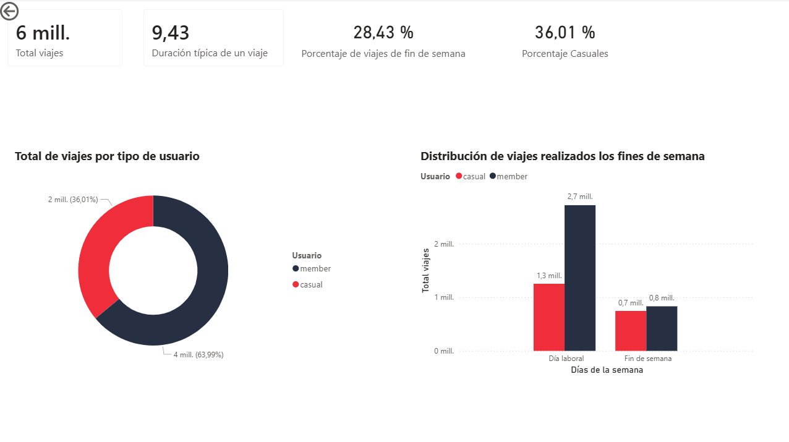
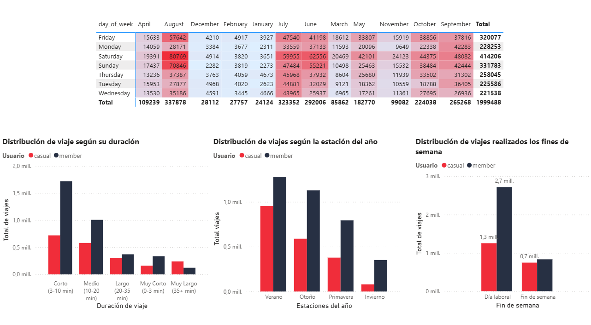
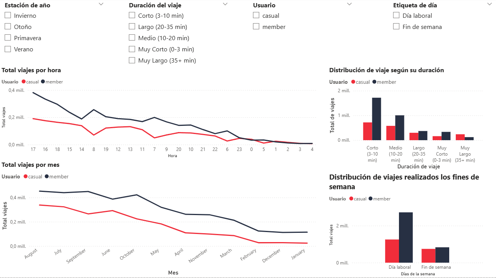

# Análisis de Usuarios Cyclistic: Estrategia de Conversión

**Por:** Erika Yesid Pinchao Rosero (urcuninna)

**Fecha:** Marzo 2026

**Herramientas:** Python, Power BI, Markdown.

## Objetivo del Proyecto (Business Task)

Identificar diferencias entre el uso de bicicletas de los ciclistas ocasionales y los miembros anuales.

**Pregunta clave:** ¿En qué se diferencia el uso de las bicicletas entre los miembros anuales y los ciclistas ocasionales?

**Tarea empresarial:** Diseñar estrategias de marketing orientadas a convertir a los ciclistas ocasionales en miembros anuales.

## Fuentes de Datos

**Fuente:** Datos históricos de Cyclistic (Motivate International Inc / Ciudad de Chicago) https://divvy-tripdata.s3.amazonaws.com/index.html.

**Periodo:** Diciembre 2024 – Diciembre 2025.

**Integridad:** Datos anonimizados (sin PII) para protección de privacidad.

## Procesamiento y Limpieza (Data Wrangling)

**Volumen:** 5,552,993 registros procesados.

**Limpieza:** EDA, perfilado, eliminación de nulos/duplicados y estandarización de formatos.

**Ingeniería de Datos:** Creación de variables temporales para análisis de comportamiento por día y duración.

**Calidad:** Datos validados bajo el estándar ROCCC.

## Análisis Exploratorio (EDA)

- El 36.01% de usuarios son casuales, mientras el 63.99% son miembros.
- La duración típica de un trayecto en bicicleta son 9 minutos, sin embargo, los usuarios casuales tienden a realizar viajes mayores a 35 minutos. La medida central usada fue la mediana ya que la tendencia de uso de los usuarios ocasionales empujaba la media de manera drástica.
- Se identifica una diferencia de 13.68 puntos porcentuales entre usuarios casuales y miembros en el uso del servicio durante fines de semana. Este comportamiento posiblemente está ligado a uso recreativo y de ocio por parte de los usuarios casuales, lo que los lleva a usar el servicio particularmente los fines de semana.
- El patrón de duración revela una segmentación funcional clara sobre el uso del servicio, mientras los miembros utilizan el servicio para desplazamientos cortos y estructurados, los usuarios casuales realizan trayectos más largos, lo que sugiere un uso recreativo, experiencial y quizá turístico, pp 12.29.
- Los usuarios casuales muestran mayor concentración de uso en verano, una estación favorecida por el clima, el turismo, vacaciones y ocio, mientras que los miembros mantienen un patrón más estable a lo largo del año, pp 11.67.

## Dashboard Interactivo



Vista inicial y general del dashboard se señalan las métricas claves del análisis, la distribución de la población y se muestra la tendencia de el driver más fuerte para las estrategias de conversión, los fines de semana.



Vista de la distribución de comportamiento de los usuarios casuales y miembros según la duración de trayecto, estaciones de año y fines de semana.


Se realizó un análisis de sensibilidad para cada estrategia mediante tres escenarios de captación: conservador (5%), moderado (10%) y optimista (15%). El objetivo es proyectar el impacto potencial de cada propuesta bajo distintas condiciones de rendimiento.



La última vista permite la exploración interactiva del comportamiento

## Conclusiones y Recomendaciones

**1. Membresías de fines de semana:** Diseñar un plan de membresía que  vincule a usuarios casuales de manera anual al servicio.

*Impacto esperado:* Incrementar la conversión del segmento casual reduciendo la barrera de compromiso asociada a planes anuales y capturando valor en momentos de alta motivación de uso.

**2. Enfoque veraniego:** Maximizar la visibilidad del servicio en verano, captando al usuario en su punto máximo de interés recreativo. 

*Impacto esperado:* Atraer la captación de turistas en épocas veraniegas. 

**3. Promociones por duración:** Establecer flexibilidad en precios para duraciones de más de 35 minutos.

*Impacto esperado:* Sostener la permanencia de las membresía para usuarios que antes eran casuales.

El verano muestra el mayor potencial de conversión debido al alto volumen de viajes realizados por usuarios casuales durante esta temporada. Sin embargo, es importante considerar que la estrategia de fines de semana representa una oportunidad más constante a lo largo del año.
Al mismo tiempo, el análisis revela que el número de viajes aumenta significativamente durante el verano, lo que sugiere que combinar la estrategia de verano con promociones enfocadas en fines de semana podría maximizar el impacto, aprovechando los periodos de mayor flujo de usuarios.en verano que en fin de semana sin embargo el predictor fuerte es weekend

## Estructura del Repositorio

```
cyclistic-project
│
├── data
│   └── csv
│
├── imagenes
│   ├── comportamiento.png
│   ├── impacto_estrategias.png
│   ├── overview.png
│   └── segmentacion.png
│
├── notebooks
│   ├── 00_exploracion_inicial.ipynb
│   ├── 01_eda_diagnostico_general.ipynb
│   ├── 02_eda_diagnostico_muestra.ipynb
│   ├── 03_validacion_eda.ipynb
│   └── analisis_cyclistic.md
│
├── reportes
│   ├── dashboard_cyclistic.pbix
│   ├── presentacion_ejecutiva_cyclistic.pdf
│   └── resumen_ejecutivo_cyclistic.pdf
│
├── scripts
│   ├── validacion.py
│   └── integracion.py
│
└── .gitignore
```
> **Note:** Raw datasets (`.csv`) and the Power BI file (`.pbix`) are excluded from this repository due to file size limitations.  
> They were used during the analysis but are ignored using `.gitignore`.
